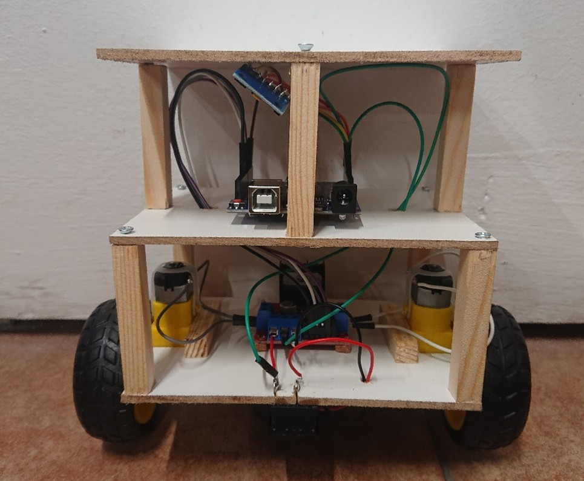
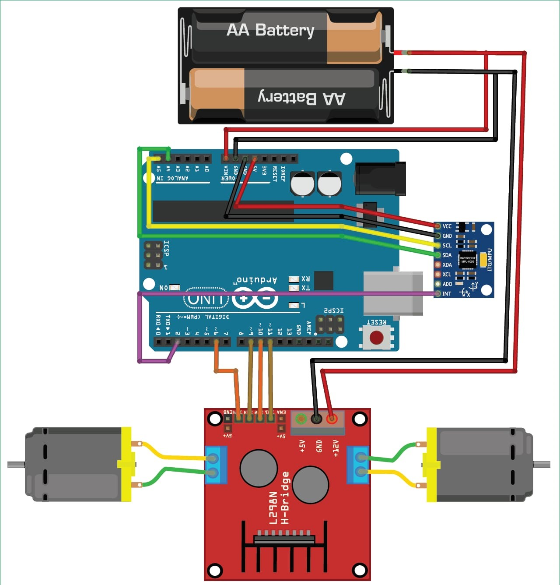
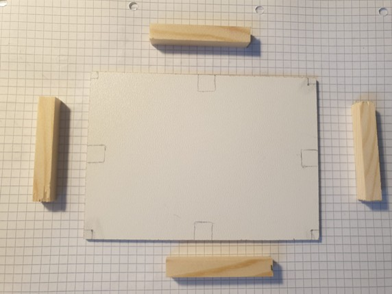
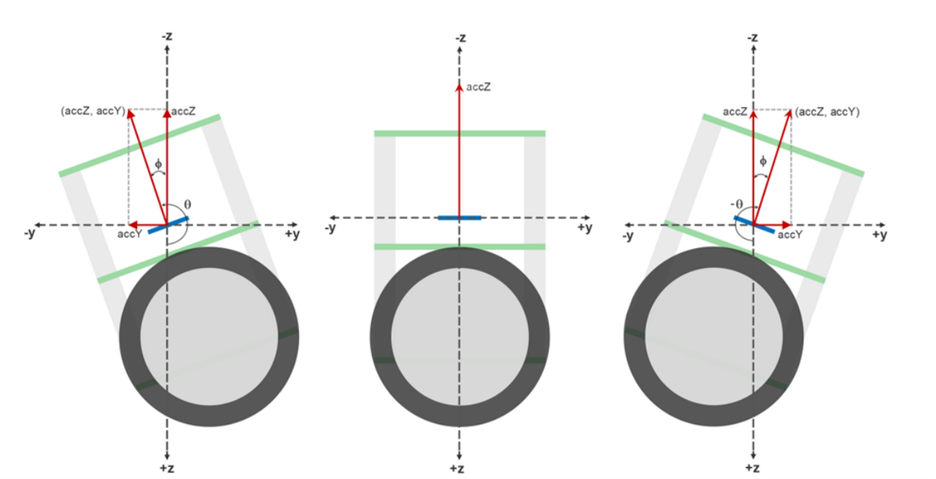

# Self balancing robot project

Hello there! Let me introduce my little self balancing robot:

This is it, just like a toy with a chassis made of wood, this little robot is able to balance on two wheels. But let's explore the biggest question HOW?

## Bill of materials

For this project I used several active electronical components to work together. 

  - [x] 1 x Aruduino UNO board
  - [x] 1 x MPU-6050 sensor: 1 x Gyroscope & 1 x accelerometer
  - [x] 2 x DC Motor
  - [x] 1 x LN-298n motor driver
  - [x] 2 x Wheels (yes, only two...   （⊙ｏ⊙）)
  - [x] 1 x Switch
  - [x] 1 x Battery holder
  - [x] 2 x Batteries
  - [x] Jumpers

## Electrical scheme

With all these materials the following electrical scheme was realized:

The main challenge in this project was positioning the electrical components in such a way that gave the robot the best possible balance. Since there are all other factors by the environment which could influence the balance (as in the case of _stochastic systems_), the placement of these elements was crucial during the assembly process.

The symmetry of the chassis was also important to engineer. The more symmetryical the chassis is, the more the balance will be certain. I focused on this symmetry during the projection process.

The system as a whole concept can be looked as a _inverted pendulum_ as shown in the next figure:

## Theory of Operation

### 1. Power

The robot’s components operate at a voltage of 5 V, supplied by the batteries mounted beneath the chassis (the lowest part of the system). This power source drives the entire system and provides energy to the Arduino UNO board (which serves as the robot’s processing unit) and to the LN-298n motor driver, both of them using the same ground. All the power is distributed from the board's power pins (see _5 V_ and _GND_ pins). This powerline will fed the MPU-6050 module.

### 2. Converting the data

The MPU-6050 module integrates both an accelerometer and a gyroscope into a single embedded system. The output signals from these sensors are analog and are connected into the dedicated analog pins of the Arduino UNO board.

The analog signals are supplied by this MPU-6050 integrated circuit, which is located at the top of the system. All incoming analog data is received from the _serial data_ and _serial clock_ pins (I2C communication protocol with the Arduino board). This data is converted into digital with the help of an ADC controller, already embedded into the Arduino UNO's system. This IC plays a crucial role in maintaining the robot’s balance.

The output of this IC is coming from the system's _INT_ (Interrupt) pin. This is a dedicated event-driven signal provider pin, which will notify the motherboard when the data is ready to be processed. This signal's form is nothing else than a PWM wave, and can be configured to proceed on the falling or rising edge of the periodical wave signal.

There are four PWM signals generated by the Arduino UNO board (each motor needs two control inputs: _forward_ & _backward_ movements; four signals in total).

### 3. The DC motors

The whole system, as the reader can see, is build on two wheels, both of them mounted to the DC motors. These motors are controlled through the LN-298n device. As mentioned before, this motor driver gets it's power directly from the source, using the same GND. 

The digital pins of the Arduino UNO's board are able to send the four PWM signals to a certain electronic device. In this case, these PWM signals are sent for the LN-298n driver. Four of these kind of signals are inputed into the motor driver. 

## Use in everyday life

This project can be seen as a small prototype for even bigger robots. The project is a good demonstration of the inverted pendulum principle, how different electrical devices communicate with eatchother (see the communication protocols used). Perhaps a bigger robot can be used in the future industry, where the space is limited and an automated robot is needed to proceed a certain task.